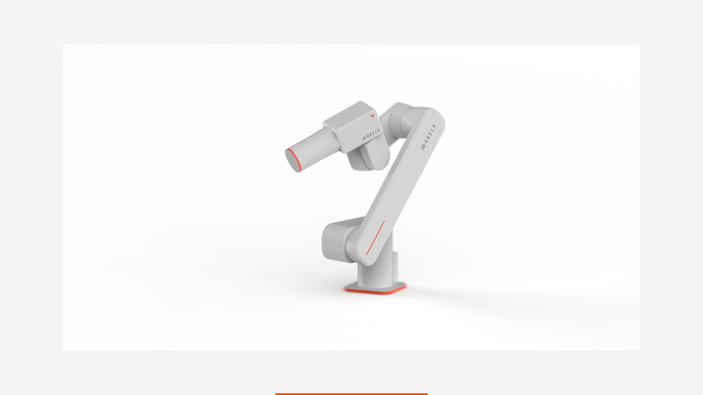

# Low-cost Light-weight Arm (LLA)

> A compact, lightweight, and force-controlled collaborative robotic arm for safe and intelligent manipulation.

---

## Overview

The **LCLWA** is a low-cost, modular robotic arm platform designed for:

- Lightweight deployment  
- Safe human–robot interaction  
- Force-aware manipulation  
- Seamless integration with intelligent systems  

Suitable for service robotics, research platforms, and embodied AI applications.

---

## Key Specifications

- **6 / 7 DoF configuration**
- **Payload ≥ 1.5 kg**
- **Arm weight ≤ 6 kg**
- **Reach ≥ 700 mm**
- **Joint torque sensing**
- **Impedance / Admittance / Torque control**

---

## Applications

- Collaborative manipulation  
- Service robotics  
- Property automation  
- Research & education  
